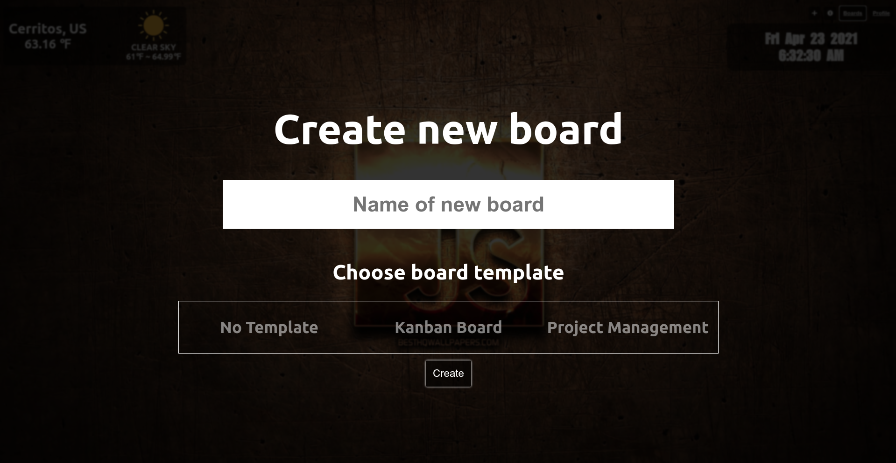
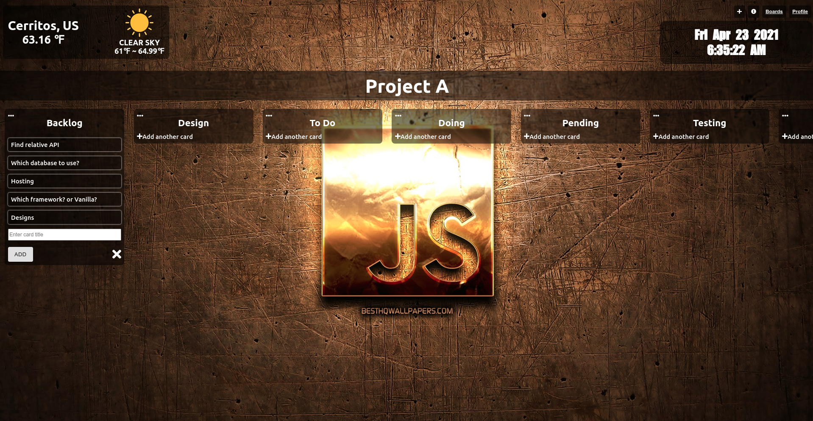
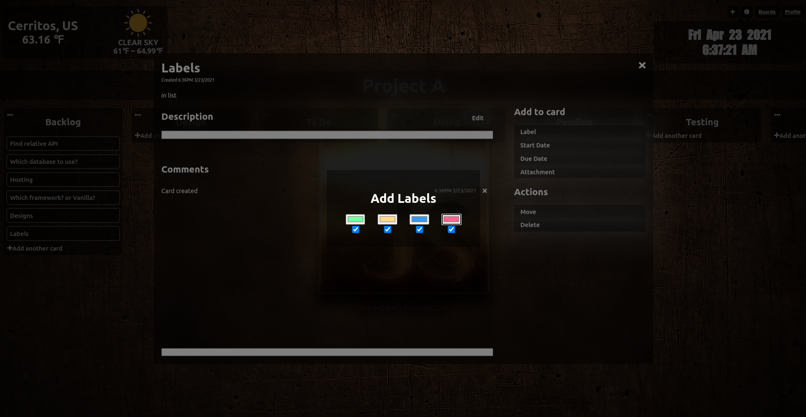
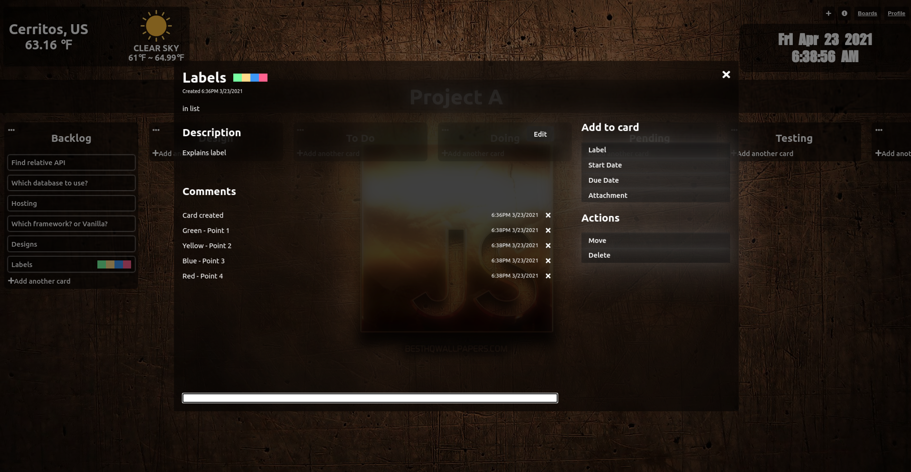
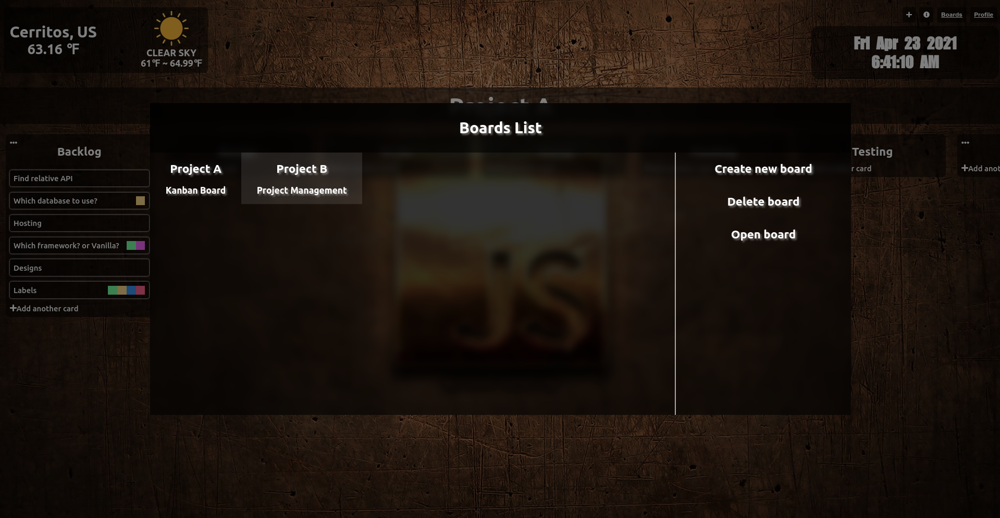

# GC Board📋📌

##

**_On-going project_**

A Trello inspired task management application.

##

##

### Key Features❗

&nbsp;&nbsp;&nbsp;&nbsp;&nbsp;&nbsp; ✅ Multiple choices of board templates. (Currently only Kanban and Project Management😒) 
&nbsp;&nbsp;&nbsp;&nbsp;&nbsp;&nbsp; ✅ Displays weather info⛅, time and date📅 on top of the board. 
&nbsp;&nbsp;&nbsp;&nbsp;&nbsp;&nbsp; ✅ Create custom boards📋. 
&nbsp;&nbsp;&nbsp;&nbsp;&nbsp;&nbsp; ✅ Create multiple boards📋📋📋. 
&nbsp;&nbsp;&nbsp;&nbsp;&nbsp;&nbsp; ✅ Create multiples lists, and cards that will go along with them🍴. 
&nbsp;&nbsp;&nbsp;&nbsp;&nbsp;&nbsp; ✅ Labeling cards by their category, types, etc. 💴💵💶💷(4 color available and adjustable) 
&nbsp;&nbsp;&nbsp;&nbsp;&nbsp;&nbsp; ✅ Add description to the cards and record works done by commenting on cards. 
&nbsp;&nbsp;&nbsp;&nbsp;&nbsp;&nbsp; ✅ A theme for dark theme lovers😎😎. 
&nbsp;&nbsp;&nbsp;&nbsp;&nbsp;&nbsp; ✅ Saves board data to browser's 🌐local storage. 
&nbsp;&nbsp;&nbsp;&nbsp;&nbsp;&nbsp; 🔜 Drag and drop to move the lists and cards. 
&nbsp;&nbsp;&nbsp;&nbsp;&nbsp;&nbsp; 🔜 Sort option on lists. 
&nbsp;&nbsp;&nbsp;&nbsp;&nbsp;&nbsp; 🔜 Change background image. 
&nbsp;&nbsp;&nbsp;&nbsp;&nbsp;&nbsp; 🔜 Save custom made templates. 

##

##

##

## Techs Used❗

&nbsp;&nbsp;&nbsp;&nbsp;&nbsp;&nbsp; ✌ React 
&nbsp;&nbsp;&nbsp;&nbsp;&nbsp;&nbsp; ✌ Styled Components 
&nbsp;&nbsp;&nbsp;&nbsp;&nbsp;&nbsp; ✌ Prop-Types 
&nbsp;&nbsp;&nbsp;&nbsp;&nbsp;&nbsp; ✌ Axios 
&nbsp;&nbsp;&nbsp;&nbsp;&nbsp;&nbsp; ✌ UUID 
&nbsp;&nbsp;&nbsp;&nbsp;&nbsp;&nbsp; ✌ GH Pages 

##

##

##

##

##

# Create New Board

##

##

##

##

##

# Kanban Board Sample

##

##

##

##

##

# Adding Labels To a Card

**_Provides 4 color options. Each color options can be customized._**

##

##

##

##

##

# Editing Card

**_In each card, users can add/edit description, label, and comments._**

##

##

##

##

##

# Boards List

**_Here, users can create, delete, and switch between their boards._**

